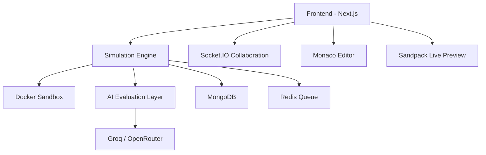

# ENUM

### AI-Powered Production Engineering Simulation Platform

> Train developers for production, not just programming.

ENUM is an AI-powered engineering simulation platform designed to bridge the gap between theoretical coding practice and real-world software engineering.

Instead of solving isolated algorithmic puzzles, developers debug live production-like systems inside interactive sandboxed environments with terminals, logs, browser previews, Docker containers, collaborative workspaces, and AI-assisted debugging workflows.

Built for the **Future of Productivity** track, ENUM transforms engineering education into realistic production training.

---

# Problem

Traditional coding platforms teach:

* syntax
* algorithms
* isolated interview questions

But modern engineering teams hire developers to:

* debug production outages
* trace failing APIs
* resolve CI/CD failures
* investigate logs
* optimize unstable systems
* collaborate under pressure

There is currently no scalable platform that realistically simulates:

* production engineering
* debugging workflows
* incident response
* infrastructure failures
* collaborative troubleshooting

As a result:

* students remain unprepared for real jobs
* onboarding takes months
* companies struggle to evaluate practical engineering skills

ENUM solves this by recreating real software engineering environments directly in the browser.

---

# What is ENUM?

ENUM is a competitive developer training and evaluation platform where users solve:

* frontend failures
* backend bugs
* DevOps incidents
* Linux shell problems
* system design simulations
* production outages

inside realistic sandboxed environments.

Unlike traditional coding platforms, ENUM provides:

* live browser previews
* integrated terminals
* real logs and metrics
* collaborative debugging
* AI-generated incidents
* automated engineering evaluation

The goal is simple:

> Make developers production-ready through hands-on engineering simulations.

---

# Core Features

## AI-Powered Incident Generation

ENUM uses LLMs to generate realistic engineering incidents including:

* React hydration mismatches
* memory leaks
* race conditions
* broken deployments
* failing APIs
* CI/CD failures
* Docker runtime issues
* Linux shell debugging tasks

AI dynamically adjusts difficulty based on user performance.

---

## Production Simulation Workspace

Each simulation includes:

* Monaco Editor
* live preview
* terminal access
* logs and metrics
* multi-file codebase
* Docker-backed execution

Users debug systems exactly like real engineers.

---

## Interactive Incident Operations Simulator

ENUM includes live incident response simulations where users:

* diagnose outages
* inspect service topologies
* analyze metrics
* deploy remediation actions
* restore failing systems

Features include:

* dynamic metric degradation
* root-cause analysis
* remediation scoring
* post-incident evaluation

---

## AI Debugging Assistant

AI assists developers by:

* analyzing stack traces
* generating contextual hints
* evaluating debugging methodology
* detecting weak engineering decisions
* providing progressive guidance

The system focuses on helping users reason through problems instead of simply revealing solutions.

---

## Real-Time Collaborative Debugging

Built-in Socket.IO collaboration enables:

* shared code editing
* live cursor synchronization
* collaborative terminal sessions
* file locking
* multiplayer debugging

Teams can practice incident response together in real time.

---

## Multi-Domain Engineering Tracks

ENUM supports:

* Frontend Engineering
* Backend Engineering
* DevOps
* Linux & Shell
* System Design
* DSA Arena
* Production Incident Operations

Each track focuses on practical engineering workflows.

---

# Why ENUM Matters

Most platforms optimize developers for interviews.

ENUM optimizes developers for engineering.

The platform simulates:

* pressure
* debugging workflows
* incomplete information
* production complexity
* collaborative problem-solving

These are the skills companies actually value.

---

# Architecture



---

# Tech Stack

| Layer                   | Technologies                                         |
| ----------------------- | ---------------------------------------------------- |
| Frontend                | Next.js, React, TailwindCSS, Monaco Editor, Sandpack |
| Backend                 | Node.js, Express.js, Prisma                          |
| Database                | MongoDB                                              |
| Caching & Queues        | Redis, Bull                                          |
| Sandbox Execution       | Docker                                               |
| Real-Time Collaboration | Socket.IO                                            |
| AI Infrastructure       | Groq, OpenRouter                                     |
| System Design Arena     | React Flow                                           |
| Authentication          | JWT, OAuth                                           |
| Storage                 | Cloudinary                                           |
| Testing                 | Jest                                                 |
| Deployment              | Vercel, Render, DigitalOcean                         |

Tech stack sourced directly from the project architecture and package configuration.

---

# Key Platform Modules

## DSA Arena

Competitive coding environment with:

* multi-language execution
* submissions
* editorials
* complexity analysis
* community solutions

---

## Linux Arena

Interactive Bash and Linux shell challenges with:

* terminal emulation
* isolated execution
* filesystem simulations
* stdout validation

---

## System Design Arena

Architecture-based simulations using React Flow where users design scalable systems and receive automated evaluation.

---

## Incident Operations

Real-time outage simulations with:

* service topology visualization
* metrics degradation
* remediation actions
* operational scoring

---

## Complexity Analyzer

AI-assisted complexity evaluation system supporting:

* static AST analysis
* runtime benchmarking
* ML-based complexity prediction
* O(n) classification

---

# AI Integration

ENUM uses AI meaningfully instead of treating it like decorative glitter for pitch decks.

AI is used for:

* incident generation
* debugging hints
* reasoning evaluation
* adaptive difficulty
* complexity explanation
* engineering feedback
* automated grading

Primary models:

* Llama 3
* DeepSeek
* Gemini
* Groq-hosted inference

---

# Demo Flow

1. User selects a production incident
2. ENUM launches a sandboxed environment
3. Broken application loads with logs and metrics
4. User debugs issue using editor + terminal
5. AI provides contextual hints
6. User deploys fix
7. Automated tests evaluate correctness
8. ENUM scores engineering performance
9. XP and analytics update in real time

---

# Real-World Simulations

ENUM supports scenarios such as:

* hydration mismatches
* failing CI/CD pipelines
* API contract mismatches
* N+1 database queries
* race conditions
* memory leaks
* Docker failures
* environment variable issues
* authentication breakdowns
* service outages

Simulation categories are derived directly from the current ENUM architecture.

---

# Scalability

ENUM is designed for large-scale concurrent engineering simulations using:

* Docker-based isolation
* Redis-backed queues
* distributed execution
* modular microservice-friendly architecture
* cloud deployment support

Future scaling includes Kubernetes-based orchestration.

---

# Security

* JWT authentication
* OAuth integration
* sandboxed code execution
* isolated containers
* role-based access control
* protected APIs
* rate limiting
* secure file uploads

Because letting strangers execute arbitrary code on your infrastructure without isolation is how companies accidentally invent cybersecurity documentaries.

---

# Getting Started

## Installation

```bash
git clone https://github.com/your-username/enum.git
cd enum
npm install
```

---

## Environment Variables

```env
MONGODB_URI=
JWT_SECRET=
GROQ_API_KEY=
OPENROUTER_API_KEY=
CLOUDINARY_URL=
REDIS_URL=
```

---

## Run Development Server

```bash
npm run dev
```

Open:

```bash
http://localhost:3000
```

---

# Future Roadmap

* AI-generated infinite simulations
* Kubernetes sandbox orchestration
* observability integrations
* recruiter dashboards
* multiplayer incident competitions
* ML engineering tracks
* voice-assisted debugging
* distributed systems simulations
* production traffic replay

---

# Hackathon Track

## Future of Productivity

ENUM directly improves:

* developer productivity
* onboarding efficiency
* engineering training
* practical hiring evaluation
* debugging workflows

Instead of another AI chatbot pretending to be revolutionary because it summarizes meeting notes faster.

ENUM focuses on real engineering productivity.

---

# Team

* Abhinavpreet Singh Arora
* Pratham Mittal
* Damanpreet Kaur

---

# Vision

> The future of engineering education is not memorizing syntax.
>
> It is learning how to debug, reason, collaborate, and survive production systems.

ENUM is building that future.
